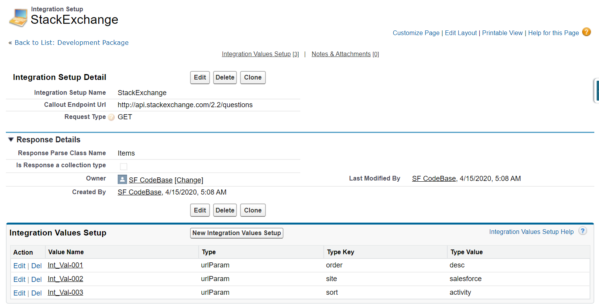
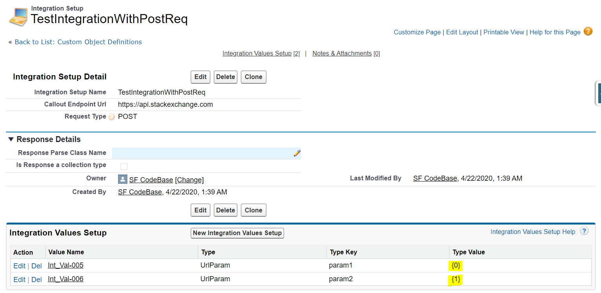

# Integration Accelerator Asset
## User Manual

### Package Components	 
#### Resources (3)
|Component Name|Parent Object|Component Type|
|--------------|-------------|--------------|
|All	|Integration Setup|	List View|
|Integration Values Setup Layout|Integration Values Setup|Page Layout|
|Integration Setup Layout|Integration Setup|Page Layout|

 
#### Code (4)
|Component Name|Parent Object|Component Type|
|--------------|-------------|--------------|
|HttpApiFactory_Test||Apex Class|
|HttpApiCustomException||Apex Class|
|HttpApiFactory||Apex Class|
|MockHttpResponseGeneratorForHTTPFactory||Apex Class|

 
#### Objects (2)
|Component Name|Parent Object|Component Type|
|--------------|-------------|--------------|
|Integration Setup||Custom Object|
|Integration Values Setup||Custom Object|

#### Fields (8)
|Component Name|Parent Object|Component Type|
|--------------|-------------|--------------|
|Related Integration Setup|Integration Values Setup|Custom Field|
|Type Key|Integration Values Setup|Custom Field|
|Response Parse Class Name|Integration Setup|Custom Field|
|Callout Endpoint Url|Integration Setup|Custom Field|
|Request Type|Integration Setup|Custom Field|
|Type Value|	Integration Values Setup|Custom Field|
|Type|	Integration Values Setup|Custom Field|
|Is Response a collection type|Integration Setup|Custom Field|
 
 
#### Tabs (1)
|Component Name|Parent Object|Component Type|
|--------------|-------------|--------------|
|Integration Setup||Tab|

Every component in the package is editable. 
1. Check for desired profile to enable Integration Setup Tab in your org.
2. Create a record in Integration Setup object with following details<br/>
** Name for Integration – This would be used as identifier in our integration framework. So, this could be kept as unique name.<br/>
** End Point Url<br/>
** Request Type – **GET, POST, PUT, PATCH** *(Note: It is expected there will remote site settings for domain url if the request is of type GET)*<br/>
** Response Parse Class Name – Ideally for any response we would be getting in any integration, we create a wrapper class. We could also use sObject name here if desired response is of type sObject details.<br/>
** Is Response a collection type – if the response is of type collection, pls check this checkbox.<br/>
3. If the Integration Setup created above needs to set header details or url parameters, create record in Related List – Integration Values Setup.
4. Create a record in Integration values setup with following details.
** Related Integration Setup – Master detail field with Integration setup object.<br/>
** Type – Header or Url Param.<br/>
** Type Key – Key element for Type.<br/>
** Type Value – Value element for Type.<br/>
If the value is expected to be dynamic use a placeholder like this {0},{1},{2}. We will pass list of String for these values to be replaced. For Ex:

|Type Key|Type Value|
|--------|----------|
|Param 1|{0}|
|Param 2|{1}|
|Param 3|{2}|

We will pass List of String and each index in List will replace the placeholder dynamically. Refer image above


Things to consider:
* It is suggested to create a Named Credential if the Authentication is of type Username-password or oAuth authentication.
* It is suggested to use Auth Providers and use that in named credentials to set up authentication.
* Endpoint generated created in Named Credentials can be used in Integration Setup object. 

Screenshots for example:

---


#### Code Snippets
**The code supports both static and non static methods. Below is the snippet for various use-cases.**
*Static Methods*
```
// Specifically for GET Request where we need to hit endpoint with static parameters or no parameters
HttpApiFactory.requestResourceStatic(<Integration Setup Name>) 
```

```
//Specifically for POST Method.
HttpApiFactory.requestResourceStatic(<Integration Setup Name>,<JSON String for POST Method>)
```

```
// Specifically for GET Method where we need to have dynamic parameter values. Each Index of List will be considered as parameter value.
HttpApiFactory.requestResourceStatic(<Integration Setup Name>,<List of String parameter values>);
```
*Non-Static Methods*
```
// Specifically for GET Request where we need to hit endpoint with static parameters or no parameters
HttpApiFactory apiFactory = new HttpApiFactory();
apiFactory.requestResourceStatic(<Integration Setup Name>) 
```

```
//Specifically for POST Method.
HttpApiFactory apiFactory = new HttpApiFactory();
apiFactory.requestResourceStatic(<Integration Setup Name>,<JSON String for POST Method>)
```

```
// Specifically for GET Method where we need to have dynamic parameter values. Each Index of List will be considered as parameter value.
HttpApiFactory apiFactory = new HttpApiFactory();
apiFactory.requestResourceStatic(<Integration Setup Name>,<List of String parameter values>);
```
